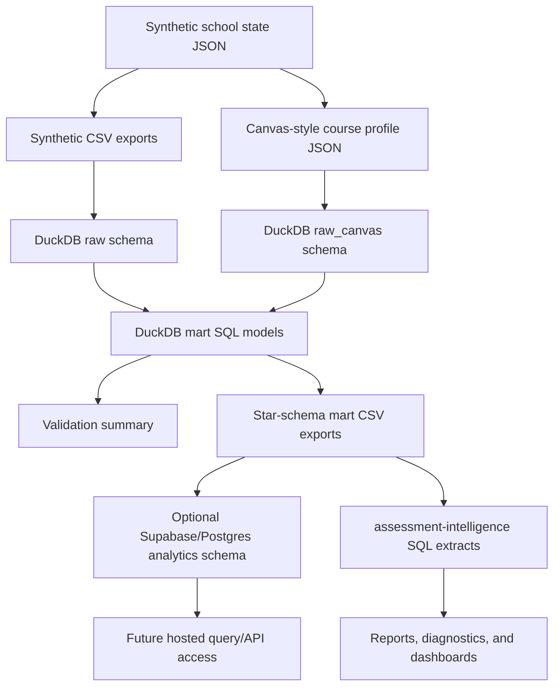

# Data Lineage

## Purpose

This document shows how the public-safe synthetic education artifacts move from generation into SQL models, validation, hosted serving, and downstream assessment analysis.

## Lineage Diagram



## Source Layer

The canonical source object is:

```text
data/synthetic/synthetic_school_state.json
```

It renders:

- `data/synthetic/synthetic_asma_gradebook.csv`
- `data/synthetic/synthetic_assessment_scores_long.csv`
- `data/synthetic/synthetic_math_courses.csv`
- `data/synthetic/synthetic_math_sections.csv`
- `data/synthetic/synthetic_math_enrollments.csv`
- `data/synthetic/assessment_shells/<school_year>/synthetic_asma_gradebook.csv`
- `data/synthetic/canvas_course_profiles/<school_year>/*.json`

## Warehouse Layer

`scripts/build_duckdb_warehouse.py` loads the generated files into DuckDB:

- `raw` schema for CSV-based assessment and department tables
- `raw_canvas` schema for normalized synthetic Canvas profile records
- `mart` schema for SQL-modeled analytics outputs

The preferred raw assessment table is `raw.assessment_scores`, loaded from the long score export. The wide gradebook remains a Canvas-style artifact, but the warehouse uses the long table for multi-year fact modeling.

The wide gradebook contains observed scores only. The long score export additionally carries synthetic latent-readiness fields so downstream checks can distinguish hidden simulated trajectory from observed score evidence.

The build exports public-safe mart CSVs to:

```text
data/marts/
```

## Reporting Schema

The reporting model includes:

- `dim_student`
- `dim_course`
- `dim_teacher`
- `dim_section`
- `dim_assignment`
- `fact_assessment_score`
- `fact_lms_enrollment`
- `validation_summary`

These tables are designed to support assessment reporting, roster reconciliation, missingness analysis, readiness summaries, and dashboard extracts.

The fact grain is explicitly multi-year:

- `fact_assessment_score`: one row per active student assessment window
- `fact_lms_enrollment`: one row per active student-year Canvas enrollment
- `student_readiness`: one row per active student-year with BOY/EOY score context

## Hosted Serving Layer

The optional Supabase/Postgres scaffold publishes the validated reporting schema into:

```text
analytics.*
```

The hosted layer is not the canonical transformation engine. It is a serving layer for synthetic, validated facts and dimensions.

## Downstream Assessment Layer

`assessment-intelligence` consumes the DuckDB warehouse and exports analysis-ready datasets for:

- course-section performance
- assignment growth by course
- non-participation by attendance and track
- LMS enrollment reconciliation
- student readiness records

This keeps the project architecture clear:

```text
synthetic-education-data = generate, validate, warehouse, publish
assessment-intelligence = analyze, report, dashboard, interpret
```
