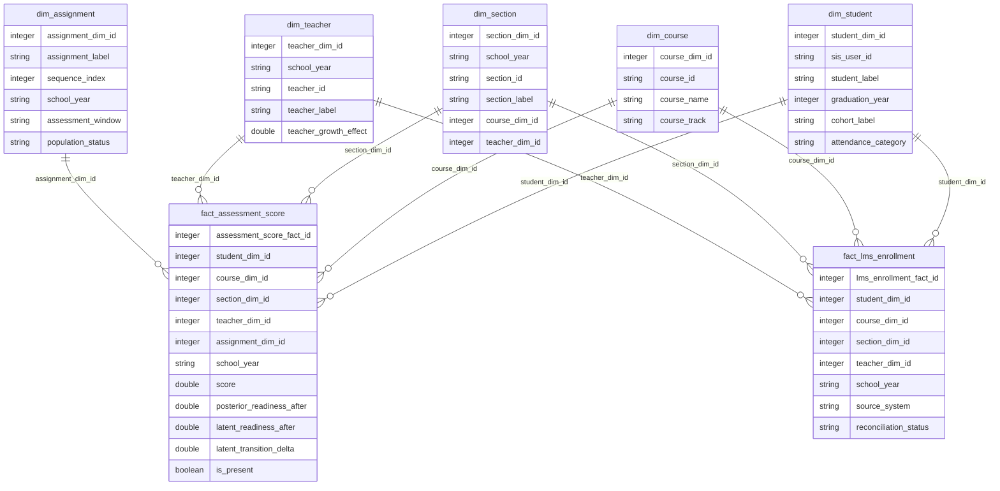

# DuckDB Star Schema ERD

The DuckDB warehouse includes a public-safe star schema for downstream assessment reporting.

## Grain

- `fact_assessment_score`: one row per active synthetic student assessment window.
- `fact_lms_enrollment`: one row per active synthetic student-year Canvas-derived enrollment.

## Use Cases

- assessment score distributions by course, section, teacher, and assignment
- assignment growth diagnostics
- non-participation and attendance checks
- LMS roster reconciliation before dashboarding
- dashboard-ready extracts for `assessment-intelligence`
